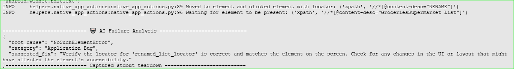

# Unified Python Playwright Automation

This repository provides a Pytest-based automation framework for testing web applications, REST APIs, and Android mobile apps. It combines Playwright for browser automation, Appium for mobile testing, and Python-based test helpers to support a single, reusable test setup.

## What this project covers

- Web UI automation with Playwright for the OrangeHRM demo application
- REST API automation for the Swagger Petstore API
- Android mobile automation for the Fast Shopping app
- Pytest reporting with HTML and JUnit output
- Optional AI-assisted failure analysis through Ollama

## Project structure

- [tests](tests) contains the test suites separated by area:
  - [tests/web](tests/web) for browser tests
  - [tests/api](tests/api) for API tests
  - [tests/mobile](tests/mobile) for mobile tests
- [pages](pages) and [helpers](helpers) contain page objects and reusable utilities
- [locators](locators) stores element locators for web and mobile flows
- [api_clients](api_clients) contains API client implementations
- [config.ini](config.ini) stores environment URLs and app configuration
- [testdata](testdata) contains JSON payloads and test data
- [reports](reports), [logs](logs), and [screenshots](screenshots) store generated outputs

## AI agents in this repository

The [ai_agents](ai_agents) folder contains two automation helpers that extend the framework with AI-assisted behavior:

- [ai_agents/auto_healer.py](ai_agents/auto_healer.py) provides a locator healing utility for Playwright. When a selector fails to resolve, it tries to repair it using an Ollama-backed suggestion, caches the repaired locator for future runs, and falls back gracefully if the model is unavailable.
- [ai_agents/failure_analyzer.py](ai_agents/failure_analyzer.py) analyzes failed test context and returns a structured JSON response with the likely root cause, category, and suggested fix. It is invoked from the pytest failure hook so failed runs can produce richer diagnostics.

e.g., if a test fails due to a missing element, the analyzer can suggest that what has caused the failure is a locator mismatch and provide a recommended fix. The analyzer can also detect other common failure types such as timeouts, assertion errors, and API response issues.



To use these features, make sure Ollama is installed and running locally, and that the required model is pulled. The default model used by both helpers is `qwen2.5-coder:7b`, and you can override it with the `ANALYZER_MODEL` or `HEALER_MODEL` environment variables as needed.

## Prerequisites

Before you begin, make sure the following tools are available on your machine:

- Python 3.10+ (3.12 recommended)
- Git
- A terminal such as PowerShell, Git Bash, or Command Prompt
- For web tests: a browser runtime installed via Playwright
- For mobile tests: Appium server and an Android emulator or a connected Android device
- Optional: Ollama installed locally if you want AI failure analysis enabled

## Clone the repository

Run the following commands in your terminal:

```powershell
git clone <your-repository-url>
cd unified-python-playwright-automation
```

## Create and activate a virtual environment

On Windows PowerShell:

```powershell
py -3.12 -m venv .venv
.\.venv\Scripts\Activate.ps1
```

If PowerShell blocks script execution, run this once in the current session:

```powershell
Set-ExecutionPolicy -Scope Process -ExecutionPolicy RemoteSigned
```

## Install Python dependencies

Install the required Python packages:

```powershell
python -m pip install --upgrade pip
pip install -r requirements.txt
```

## Install Playwright browsers

Playwright requires browser binaries before running web tests:

```powershell
playwright install chromium
```

## Configure the environment

The project uses [config.ini](config.ini) for core settings such as:

- web base URL
- pet store API base URL
- mobile app capabilities

You can update these values if you need to point the tests to another environment.

## Optional: enable AI failure analysis

This repository includes an optional AI failure analyzer that calls Ollama. If you want to use it:

1. Install Ollama locally
2. Pull a model such as:

```powershell
ollama pull qwen2.5-coder:7b
```

3. Optionally set the model name in your session:

```powershell
$env:ANALYZER_MODEL="qwen2.5-coder:7b"
```

If Ollama is not available, the tests will still run, but the AI analysis step will fall back gracefully.

## Run the tests

### Web tests

Run the full web suite:

```powershell
pytest tests/web -q
```

Run a specific web test file with default Chromium in headless mode:

```powershell
pytest tests\web\test_web_orange_hrm_pim_and_side_bar.py -s -v
```

Run the same test with Playwright traces, screenshots, and video retention:

```powershell
pytest tests\web\test_web_orange_hrm_pim_and_side_bar.py -vs --screenshot=only-on-failure --video=retain-on-failure --tracing=retain-on-failure
```

Run the web test in headed mode across multiple browsers:

```powershell
pytest tests\web\test_web_orange_hrm_pim_and_side_bar.py -s -v --headed --browser chromium --browser firefox
```

Run the web test in parallel mode:

```powershell
pytest tests\web\test_web_orange_hrm_pim_and_side_bar.py -s -v -n=2
```

### Playwright traces

When you run tests with `--tracing=retain-on-failure`, Playwright creates a trace.zip file in the project output folder. You can open it locally with the Playwright Trace Viewer:

```powershell
npx playwright show-trace trace.zip
```

If the trace file is generated in a different folder, replace `trace.zip` with the full path to the .zip file.

or 

you can open the trace directly in the browser:
- Load this URL: `https://trace.playwright.dev/`
- Drag and drop the trace.zip file into the browser window to view the recorded test session.

### API tests

```powershell
pytest tests/api -q
```

### Mobile tests

Before running mobile tests, make sure:

- Appium is installed and running
- An Android emulator is started or a device is connected
- Refer to this [repository](https://github.com/SatyamAutoDeveloper/appium-python-mobile-app-automation) for setup details and command-line instructions to start the Appium server and emulator.

Then run:

```powershell
pytest tests/mobile -q
```

## Useful pytest options

You can also run selected markers or view more detailed output:

```powershell
pytest -m smoke -q
pytest -vv
```

## Reports and output

When tests run, the framework generates:

- HTML report in [reports/report.html](reports/report.html)
- JUnit XML report in [reports/junit_results.xml](reports/junit_results.xml)
- Logs in [logs](logs)
- Screenshots in [screenshots](screenshots)

## Troubleshooting tips

- If Playwright reports missing browser binaries, run: `playwright install chromium`
- If Appium tests fail to connect, verify that the Appium server is running and that the emulator/device is reachable
- If imports fail, confirm that the virtual environment is activated and dependencies were installed successfully
- If you see authentication or demo-site issues, verify that the target environments in [config.ini](config.ini) are reachable

## Notes

This framework is designed for learning, demonstration, and practical test automation workflows. It is a good starting point for extending the suite with additional pages, data-driven cases, and CI/CD integrations.
